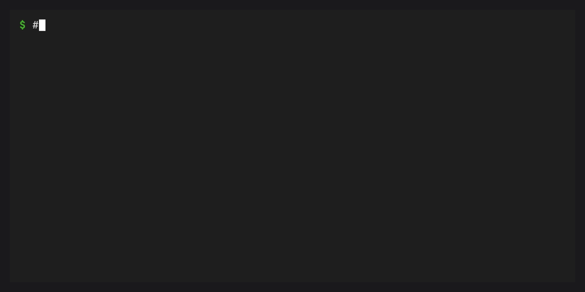

# conda-ship

[](https://github.com/jezdez/conda-ship/actions/workflows/ci.yml)
[](https://jezdez.github.io/conda-ship/)
[](https://github.com/jezdez/conda-ship/actions/workflows/zizmor.yml)
[](https://github.com/jezdez/conda-ship/blob/main/LICENSE)
[](https://python.org)

Build ready-to-run conda runtimes from solved conda environments.

`conda-ship` is a generic builder for single-binary conda runtimes. It
provides the `cs` builder CLI, the `cs-template` generic runtime template, a
composite GitHub Action, and an optional Python adapter that exposes
`conda ship` inside conda.

The project is currently alpha and pre-1.0. The split from
[`conda-express`](https://jezdez.github.io/conda-express/) is now explicit:
conda-ship owns the reusable build/runtime machinery, while downstream
distributions own their package sets, runtime names, release channels, installer
wrappers, and user documentation. conda-express is one downstream distribution
maintained by Jannis Leidel; it uses conda-ship to publish the `cx` and `cxz`
runtimes.

## Quickstart

This shortest path uses conda-workspaces to create a solved source environment,
then builds an online runtime named `demo`:

```bash
conda install --name base -c conda-forge conda-pypi
conda create -n cs-demo -c conda-forge python pip conda-workspaces
conda activate cs-demo
conda pypi install conda-ship

mkdir demo-runtime
cd demo-runtime
conda workspace init --format conda --name demo-runtime
conda workspace add --feature ship --no-lockfile-update \
  "python>=3.12" \
  "conda>=25.1" \
  conda-rattler-solver \
  "conda-spawn>=0.1.0"
cat >> conda.toml <<'TOML'

[tool.conda-ship]
runtime-name = "demo"
runtime-version = "0.1.0"
delegate-executable = "conda"
artifact-layout = "online"
source-environment = "ship"
exclude-packages = ["conda-libmamba-solver"]
TOML

conda workspace lock
cs inspect
cs build --dry-run
cs build
./dist/demo info
```

For a guided walkthrough with automatic first-run bootstrap and embedded runtime
examples, see the
[first runtime tutorial](https://jezdez.github.io/conda-ship/tutorials/first-runtime/).

## What It Builds

conda-ship stages a runtime binary plus release metadata:

- `.runtime.lock`: the lockfile stamped into the runtime
- `.packages.txt`: tab-separated package records for quick inspection
- `.info.json`: artifact metadata for release tooling
- `.sha256`: checksums for staged files
- optional `.bundle.tar.zst`: compressed package archives for offline builds

On first invocation, the runtime automatically bootstraps its managed prefix.
It then passes every argument to the configured delegate executable, usually
`conda`. Help, version, status, shell, and lifecycle commands therefore belong
to the delegate and its plugins rather than conda-ship.

During bootstrap, generated runtimes also write constructor-compatible conda
prefix metadata. The managed prefix gets `conda-meta/history` and
`conda-meta/initial-state.explicit.txt` in addition to conda-ship's ownership
metadata. Conda can recognize the prefix as an environment, and runtimes that
include `conda-self` can use that initial-state snapshot for
`conda self reset --snapshot installer-updated` or
`conda self reset --snapshot installer-exact`.

## Artifact Layouts

| Layout | Output | Bootstrap behavior |
| --- | --- | --- |
| `online` | `<runtime-name>` or `<artifact-name>` | Downloads packages from the stamped runtime lock. |
| `external` | `<runtime-name>` or `<artifact-name>` plus `<name>.bundle.tar.zst` | Uses a separate package bundle for offline-capable installs. |
| `embedded` | `<runtime-name>` or `<artifact-name>` | Embeds the compressed package bundle in one binary. |

## Project Input

conda-ship builds from an already solved source environment. It does not solve
loose matchspecs in the GitHub Action and it does not define a package set of
its own.

Supported manifest and lockfile pairs:

- `conda.toml` plus `conda.lock`
- `pyproject.toml` with `[tool.conda]` plus `conda.lock`
- `pixi.toml` plus `pixi.lock`
- `pyproject.toml` with `[tool.pixi]` plus `pixi.lock`

The package and channel intent lives in the selected source environment.
`[tool.conda-ship]` only records conda-ship build policy:

```toml
[tool.conda-ship]
runtime-name = "demo"
runtime-version = "0.1.0"
delegate-executable = "conda"
artifact-layout = "online"
source-environment = "ship"
exclude-packages = ["conda-libmamba-solver"]
```

The selected source environment defines the complete package set. It must
include the configured delegate executable and any optional commands the
distribution exposes. A conda distribution can include `conda`,
`conda-rattler-solver`, and `conda-spawn`, while a runtime with another delegate
can omit them.
Include `conda-self` when a conda runtime should
expose `conda self reset` for restoring the bootstrapped base prefix to the
initial package set shipped by the runtime.

## Local Workflow

Packaged builds find `cs-template` next to the installed `cs` executable.
Use `--template` only for an explicit template path, custom packaging, or
cross-builds.

```bash
cs inspect
cs build --dry-run
cs build
cs build --artifact-layout embedded
cs run --install-path /tmp/demo-smoke -- info
```

`cs inspect` is the preflight command. It derives the runtime lock, validates the
selected source environment, applies package exclusions, and prints the package
set without writing artifacts.



Use `cs build --dry-run` to preview the runtime metadata and staged release
asset paths before writing files.


After a real build, verify the staged artifacts and inspect the release metadata
before handing them to downstream packaging or signing.


The staged runtime is a stamped copy of the generic runtime template. It
automatically bootstraps its managed prefix when needed and otherwise behaves
like its configured delegate.

## GitHub Actions

The repository root is also a composite GitHub Action for downstream release
jobs:

```yaml
- uses: jezdez/conda-ship@FULL_RELEASE_COMMIT_SHA # X.Y.Z
  id: cs
  with:
    conda-ship-version: "X.Y.Z"
    artifact-layout: embedded
```

The action expects a committed manifest and matching lockfile. It downloads the
configured `cs`, `cs-template`, and `SHA256SUMS` release assets for the
runner, verifies their GitHub Artifact Attestations, checks the release
checksums, runs `cs build --dry-run`, and then stages the runtime into a
`dist-path` output.

Pin the action source to a full release commit SHA for release builds and pass
the matching conda-ship release through `conda-ship-version`. When the action
is invoked by an exact release tag, `conda-ship-version` can be omitted for
backwards compatibility.

## Packaging

conda-ship is not an OS installer generator. It does not target `.sh`, `.pkg`,
or `.msi` output directly. It produces runtimes that can be distributed as
GitHub Release assets or wrapped by Homebrew, constructor, Docker, enterprise
packaging systems, and other release tooling.

The PyPI package installs the `cs` builder, the `cs-template` runtime template,
and the Python adapter together. The adapter makes `conda ship` a shortcut for
the same builder when installed in a conda environment; it does not make
conda-ship part of conda itself. A future conda package should install the same
pieces into one environment.

## What Belongs Downstream

Downstream distributions decide:

- runtime names and delegates
- package sets and channels
- package exclusions
- install schemes and install names
- documentation URLs
- release channels and installers
- signing, SBOM, and in-toto provenance for final artifacts

conda-ship verifies the inputs it consumes and the package archives it stages or
installs, but downstream release systems should sign and attest the final
runtime artifacts after `cs build`.

## Documentation

Full documentation is available at
[jezdez.github.io/conda-ship](https://jezdez.github.io/conda-ship/).

Useful starting points:

- [Build your first runtime](https://jezdez.github.io/conda-ship/tutorials/first-runtime/)
- [Build in GitHub Actions](https://jezdez.github.io/conda-ship/how-to/build-in-github-actions/)
- [Configuration reference](https://jezdez.github.io/conda-ship/reference/configuration/)
- [Project boundaries](https://jezdez.github.io/conda-ship/explanation/project-boundaries/)

## Development

```bash
pixi install
pixi run test
pixi run lint
pixi run -e test pytest
pixi run docs
```

`pixi run lint` runs the repository's `prek` hooks, including Rust formatting
and clippy checks.

The terminal demos are generated from `demos/*.tape` with
[VHS](https://github.com/charmbracelet/vhs):

```bash
pixi run demos
pixi run demos inspect
```

The tapes build local debug `cs` and `cs-template` binaries in hidden setup so
the visible commands match the packaged workflow.

Run `cargo generate-lockfile` after changing Cargo metadata and `pixi lock`
after changing pixi metadata.

## License

BSD-3-Clause
